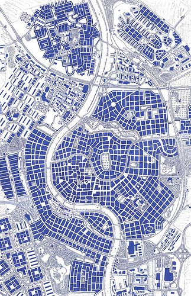
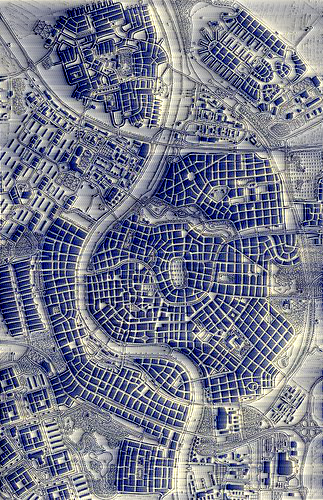

# decoherence
Using the Fourier transform of images to do crazy things.

The script used to compute the Fourier transform, `fourier.js`, is taken from https://github.com/turbomaze/JS-Fourier-Image-Analysis.
The CSS and some JS used to power the pretty gradient slider is taken from https://codepen.io/egrucza/pen/LEoOQZ.